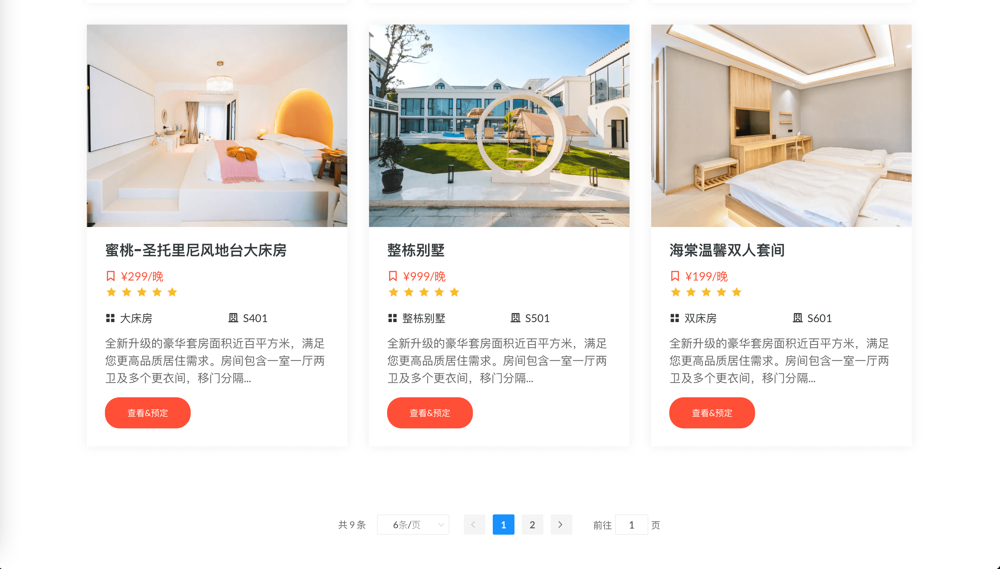
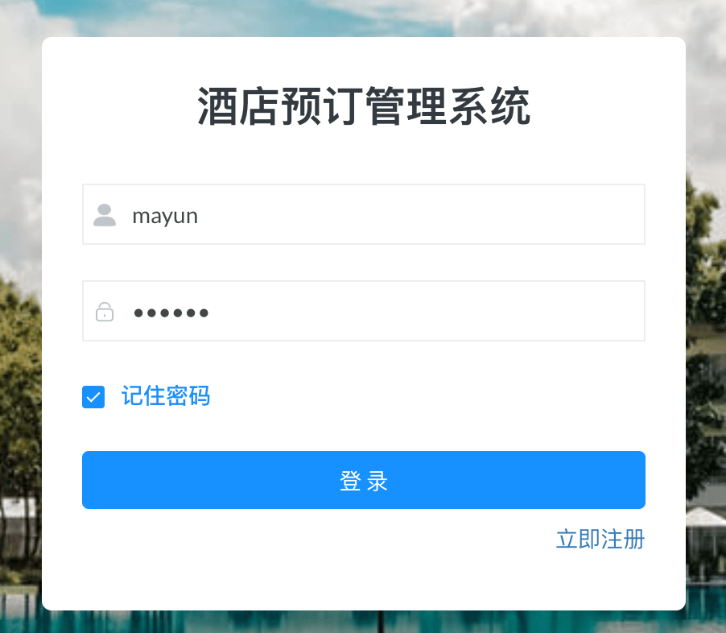
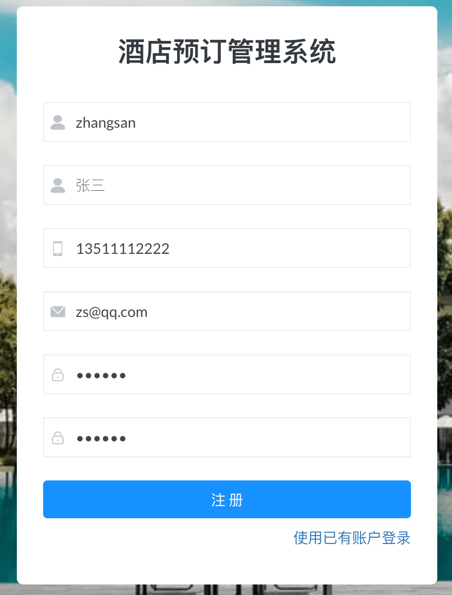
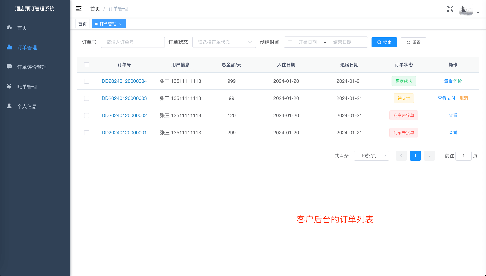
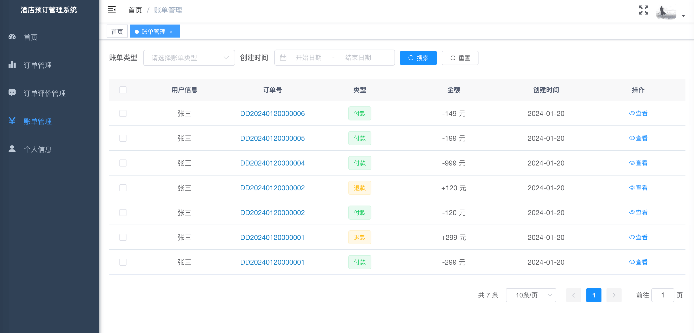
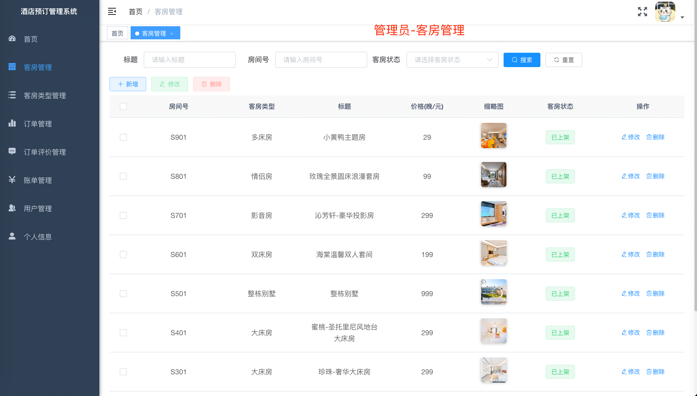
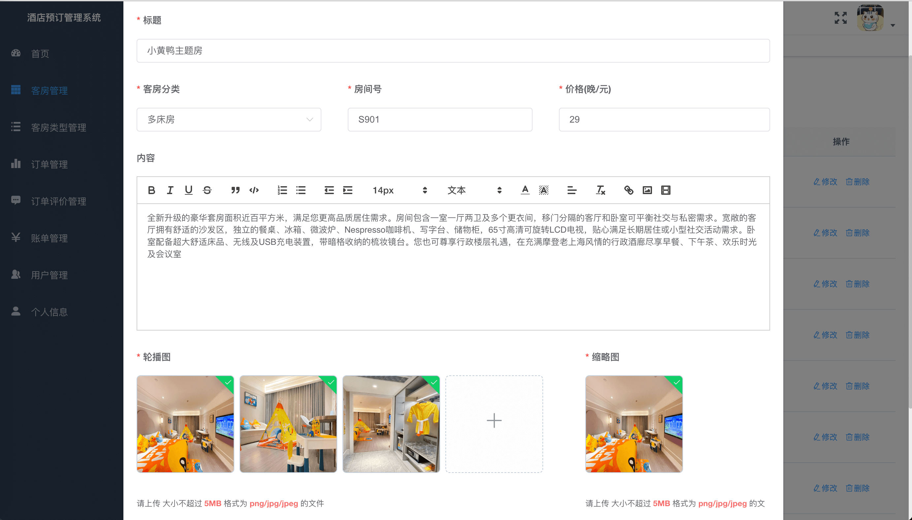
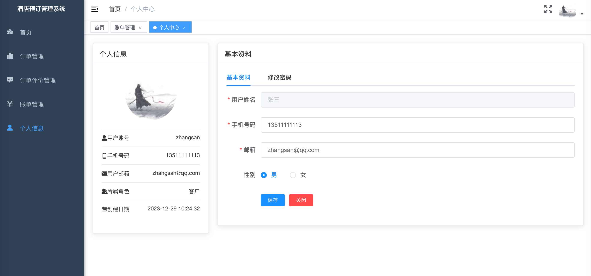

# SpringBoot Vue 酒店预订管理系统
基于SpringBoot Vue 酒店预订管理系统
[详细说明](https://liuyanzhao.com/shop/hotel-vue.html)  
#### 演示地址：
  前台页面 ：http://hotel-portal.liuyanzhao.com  
  后台管理 ：http://hotel-manage.liuyanzhao.com  
  测试账号：管理员admin、客户zhangsan、酒店前台mayun，密码都是123456  
####  演示视频：
演示视频1：B站地址：https://www.bilibili.com/video/BV15c411x7EN  
演示视频2：https://pan.baidu.com/s/1PkgC6kx90shRskENWE-l-w?pwd=9LJ3   

#### [博主开发的其他所有酒店管理系统](https://liuyanzhao.com/shop.html?k=酒店)

## 功能组成
- 主要功能模块
- 1、用户注册和登录（可注册普通客户；管理员和酒店前台人员不许注册）
- 2、客房管理 (管理员可以添加、修改和删除；酒店前台人员能查询和编辑)
- 3、客房分类管理 (管理员可以添加、修改和删除；酒店前台人员能查询和编辑)
- 4、订单管理（客户可以创建订单，支付和取消订单；酒店工作人员和管理员查询所有订单和接单，管理员可以删除订单）
- 5、订单评价管理（客户可以评价订单；酒店工作人员和管理员查询和删除所有订单评价）
- 6、账单管理(创建订单或预定失败会生成账单信息，包括付款和退款两种)
- 7、用户管理 (管理员特有功能)
- 8、用户创建订单后，会生成预定记录，锁定当前日期的房间；10分钟内未支付，会释放锁定记录
- 9、用户支付订单后，会生成支付的账系信息；30分钟内酒店(工作人员或管理员)未接单，将自动取消订单，生成退款的账单信息

## 技术组成
- SpringBoot
- MyBatis Plus
- VueJS + ElementUI
- MySQL
- Maven

## 预览
1-首页-1.png

2-首页-2.png

3-客房详情.png

4-登录.png

5-注册.png

6-预订支付页面.png

7-订单详情.png

8-客户的订单管理.png

9-订单评价.png

10-账单管理-客户.png

11-客房列表-管理员.png

12-客房编辑-管理员.png

13-用户管理-管理员.png

14-个人信息.png

15-功能菜单.png

以上为部分截图，不同角色重复页面不再截图

## 联系方式
该项目可用于酒店预订管理系统前期使用或二次开发铺垫，毕设等。  
长期更新！大家可以提需求，我可以及时更新！   
支持定制，加功能，减功能   
需要完整代码，联系本人，提供源码，远程部署和问题解答  
微信：847064370   

